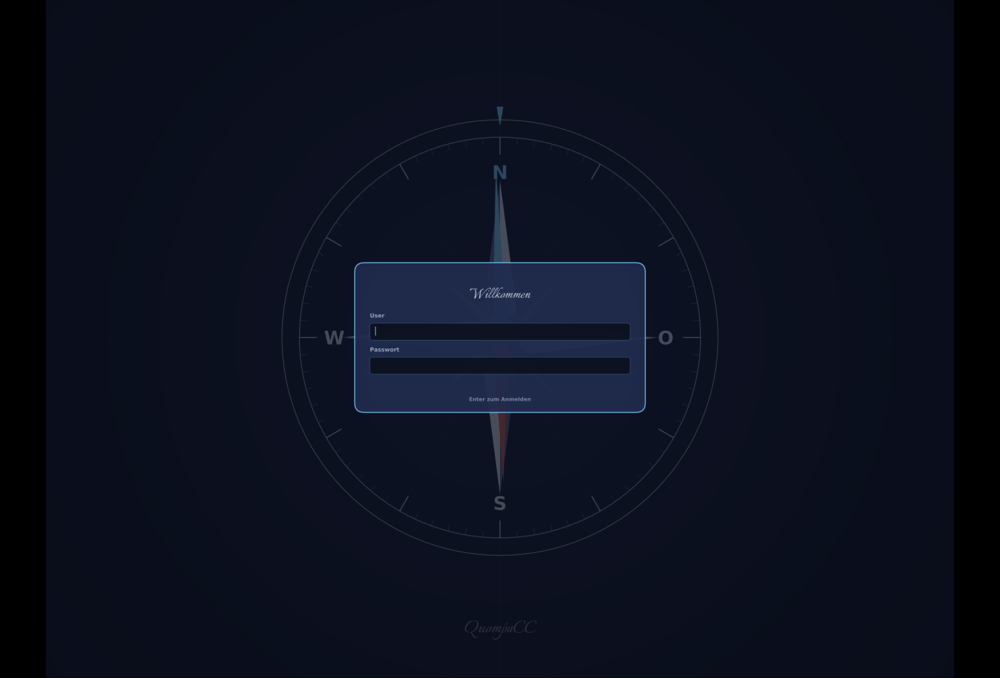
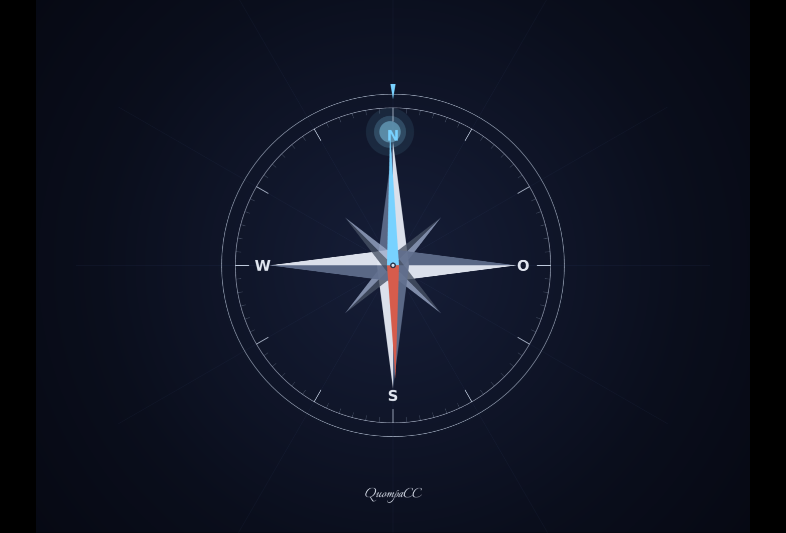
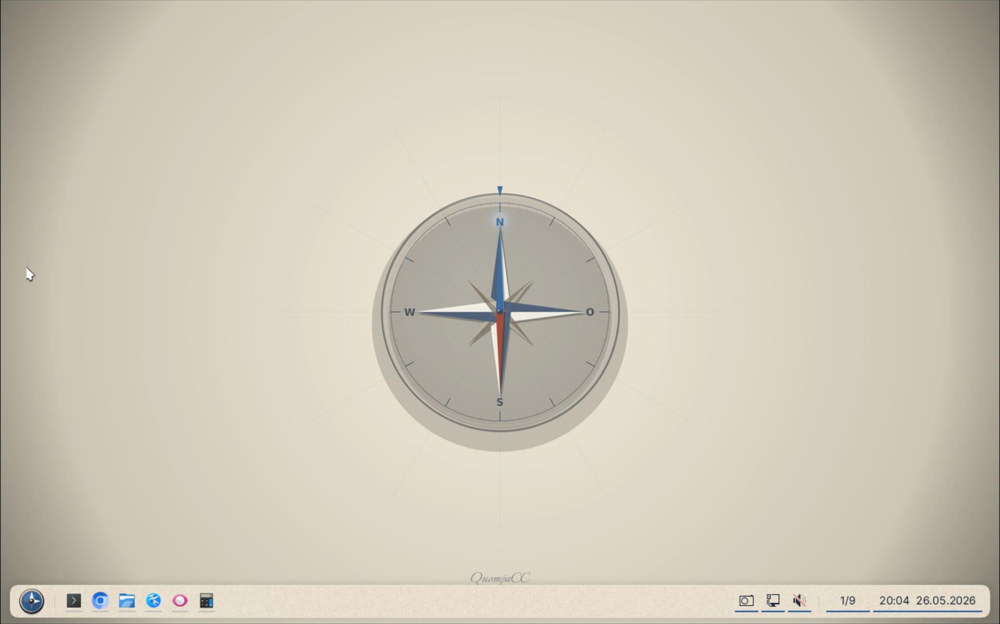
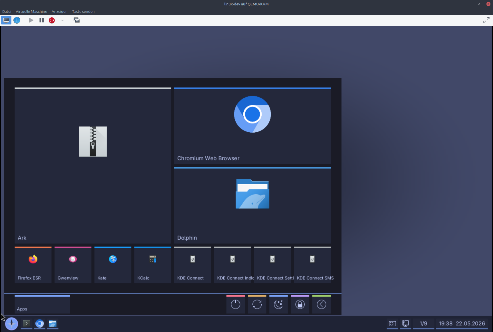

# Meridian Desktop

Meridian is a calm, modern Wayland desktop positioned between GNOME and KDE.

Wayland-first, toolkit-neutral, and opinionated in sensible defaults, Meridian focuses on productive workflows without configuration overload.

Meridian is a calm, Wayland-first desktop for users who want polish without rigidity and power without clutter.

## Vision

Meridian aims to be a full desktop environment, not just a compositor plus loose utilities.
The project focuses on a curated UX, strong runtime behavior, and practical performance on real hardware.

Long-term, Meridian targets a polished Linux desktop that feels coherent out of the box and remains responsive for everyday use and gaming-oriented workflows.

## Design Manifesto

- [Meridian Design Manifesto](docs/design-manifesto.md)
- [Technical Design Guidelines](docs/technical-design-guidelines.md)

## Current Status

Meridian is active and moving fast, but still experimental.
It is not yet ready as a daily driver for most users.

### Working now

- Wayland compositor core
- DRM/KMS backend and Winit development backend
- Shell process with panel, launcher, popups, screenshots, notifications, and a structured settings UI
- XWayland support
- IPC between compositor and shell, including window snapshots, thumbnails, workspace state, launch, reload, and quit
- Boot/login chain with `meridian-login`, PAM/logind handover, YubiKey/PIN login, and password fallback
- FileChooser portal backend via `meridian-portal`
- Ongoing NVIDIA timing and mode-selection stability work

### Experimental / in progress

- Multi-monitor polish and hotplug edge cases
- Shell idle wakeup/commit optimization, with timer and popup redraw reductions landed
- Settings UI completion beyond the current Desktop/System skeleton
- Portal screenshot/screencast support
- Lock screen frontend
- Gaming-oriented UX features

## Features Overview

- Rust workspace with separated compositor, shell, config, IPC, and WM logic
- Wayland-first architecture with a dedicated shell client
- Dedicated DRM login process with PAM/logind session lifetime management
- Dedicated portal backend process for D-Bus portal integration
- Focus on correctness in render/input paths and explicit testing discipline
- Practical diagnostics for DRM/runtime issues during development

## Boot & login experience

Meridian aims for a cohesive boot — bootloader to desktop without a single
glitch frame or hard cut to black. The chain is three cooperating processes
that hand DRM master to each other on a Unix socket; they all share the same
[`meridian-compass-render`](crates/meridian-compass-render) crate so the
compass is pixel-identical from the splash through the login screen.

| Stage                                                                            | What you see                                                                          |
|----------------------------------------------------------------------------------|---------------------------------------------------------------------------------------|
| [**bootsplash**](https://github.com/quompacc/bootsplash) (separate repo)         | full QuompaCC compass, north needle glowing — runs from `basic.target` as DRM master  |
| **meridian-login** (this repo, [`crates/meridian-login`](crates/meridian-login)) | compass dims to a watermark, the north-glow falls into a cyan login card              |
| **meridian** (this repo, the workspace's main `meridian` binary)                 | compositor takes over the framebuffer once PAM has opened a logind session            |



*meridian-login: the compass dims to a watermark and the cyan card with `Willkommen` slides in. Keyboard input goes through evdev + xkbcommon with `EVIOCGRAB` so the password never leaks to the kernel TTY.*



*bootsplash: rendered before any user-space services are up, lives until meridian-login is ready to take master.*

The login flow ([`docs/MERIDIAN_LOGIN.md`](docs/MERIDIAN_LOGIN.md)) supports
YubiKey/PIN authentication and falls back to username/password when no
registered key is ready. It authenticates through PAM, opens a logind session
via `pam_systemd`, then spawns the compositor as that user with the full
supplementary-group set (`video`, `render`, `input`, ...) and a clean
Wayland environment. The PAM handle is held for the lifetime of the
compositor; on exit it is dropped, which closes the logind session.

## Screenshots



*Desktop after login: panel at the bottom with the compass-rose launcher
on the left, pinned tiles (term · web · files), and the right-side
cluster (workspaces · network · screenshot · clock). Live on DRM/KMS —
no nested compositor.*



*App grid open, KDE apps detected from `*.desktop` files, pinned row at
the bottom of the sidebar, power actions on the right.*

## Build & Run

Dependencies are the usual Rust + Linux Wayland/DRM development stack (tooling and headers vary by distro).

```bash
cargo build --workspace
cargo test --workspace
cargo build --release --workspace
```

For release runs, use the matching binaries from this workspace so `meridian` and `meridian-shell` stay in sync:

```bash
PATH="$PWD/target/release:$PATH" target/release/meridian
```

## Development Workflow

Before opening or updating a patch:

```bash
cargo fmt --check
cargo check --workspace
cargo test --workspace
cargo clippy --workspace -- -D warnings
git diff --check
```

## Roadmap

- Foundation and stability hardening
- Shell UI quality and consistency
- Settings UI completion: fill the Desktop/System skeleton with real controls
- Portal screenshot/screencast support
- Multi-monitor and hotplug validation
- Shell idle performance and popup redraw profiling
- Gaming-friendly features and performance polish

## Contributing

Contributors are welcome.

Good first areas include:
- targeted bug fixes
- test coverage improvements
- launcher/panel UX polish
- documentation cleanup and accuracy updates

Please prefer focused, small patches with clear scope and tests where applicable.

## Philosophy / Non-goals

Meridian is intentionally opinionated:
- a fixed high-quality UI baseline
- limited, purposeful customization
- no fragmented widget/plugin wildgrowth

The goal is cohesion and reliability over endless surface-level tweakability.

## Documentation

- [Meridian Design Manifesto](docs/design-manifesto.md)
- [Technical Design Guidelines](docs/technical-design-guidelines.md)
- [Project status](docs/PROJECT_STATUS.md)
- [Architecture](docs/ARCHITECTURE.md)
- [Testing guide](docs/TESTING.md)
- [Configuration](docs/CONFIGURATION.md)
- [Debugging guide](docs/DEBUGGING.md)
- [NVIDIA passthrough notes](docs/NVIDIA_PASSTHROUGH.md)
- [Multi-monitor audit](docs/MULTI_MONITOR.md)
- [Workspace policy](docs/WORKSPACES.md)
- [XDG portals plan](docs/XDG_PORTALS.md)
- [Desktop settings contract](docs/DESKTOP_SETTINGS_CONTRACT.md)

## License

Meridian is licensed under GPL-3.0-or-later.
